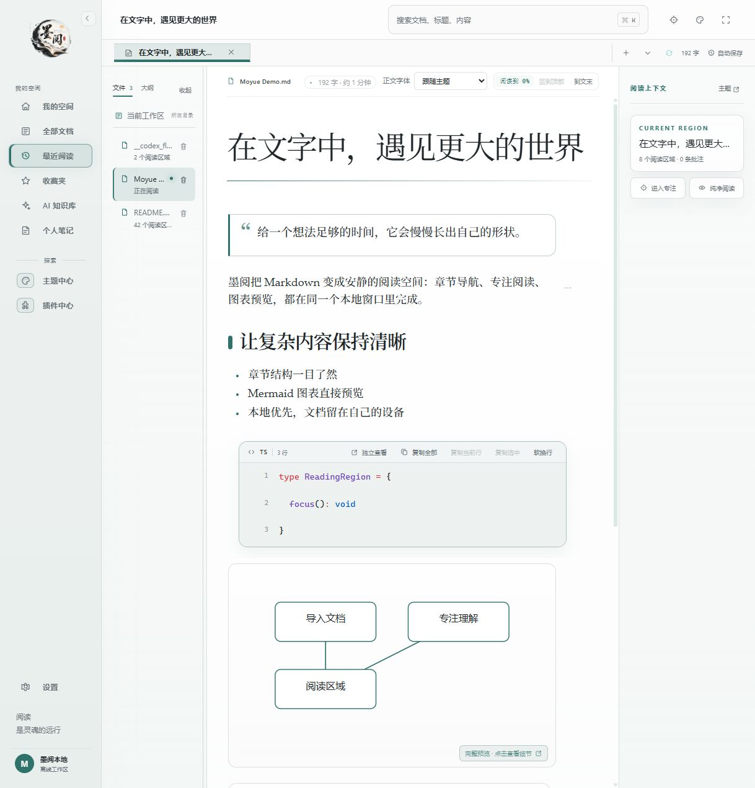
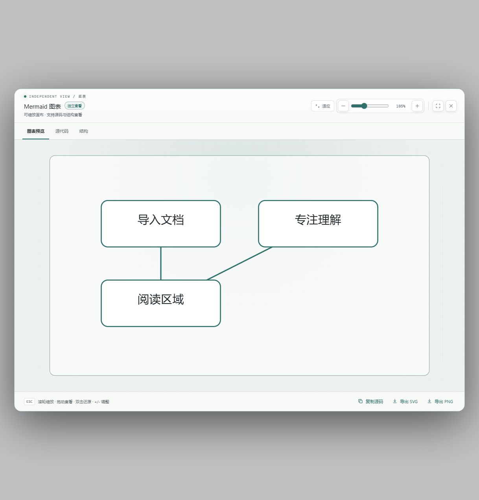
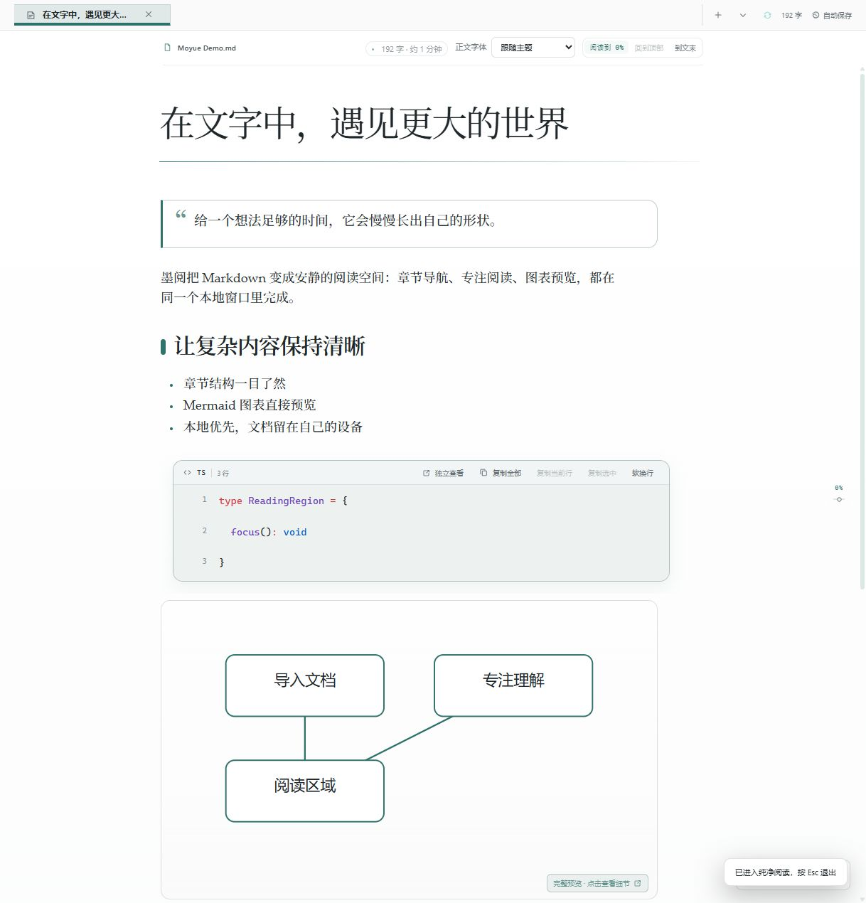

# 墨阅 Moyue Reader

> 把 Markdown 读成一段真正能停留的时间。

墨阅是一款 **本地优先、离线可用的 Markdown 沉浸式阅读器**。它不追求把编辑器做得更复杂，而是把长文档变成更容易浏览、理解和回看的阅读空间：章节导航、代码高亮、Mermaid 图表、专注模式、主题切换和阅读进度，都在一个安静的桌面窗口里完成。

## 产品预览

以下截图来自内置浏览器中的实际运行界面，示例内容为虚构文本，不包含个人文件或隐私信息。







## 为什么是墨阅？

- **为阅读而生**：Markdown 被拆成清晰的阅读区域，按章节浏览，随时聚焦当前内容。
- **长文也能读下去**：自动恢复文档、标签和滚动位置，阅读进度保存在本地。
- **代码和图表是一等内容**：Shiki 代码高亮、行号、复制；Mermaid 支持缩放、拖动、源码查看和 SVG / PNG 导出。
- **完全掌控自己的文件**：打开本地文件或文件夹即可使用，支持拖拽导入、相对图片资源和外部文件变化监听。
- **让环境适合你**：内置多种阅读主题，支持自定义主题、导入和导出主题包。

## 你可以用它做什么？

| 场景 | 墨阅提供的体验 |
| --- | --- |
| 阅读技术文档 | 目录导航、全文搜索、代码高亮、快捷键和阅读进度 |
| 学习长文章 | 专注模式、区域聚焦、划词高亮、批注和纯净阅读 |
| 查看架构与流程 | Mermaid 图表独立查看、缩放拖动、复制源码、导出图片 |
| 整理本地资料 | 打开文件夹扫描 Markdown，多文档标签、文件树和本地持久化 |
| 调整阅读氛围 | 月影深蓝、静默苔原、纯净白纸、蓝调时刻，以及可编辑主题 |

## 30 秒开始阅读

### 直接运行桌面版（推荐）

环境要求：Node.js 18+、Rust stable、Windows 10 / 11。

```bash
# 进入项目目录后执行
npm install
npm run tauri dev
```

启动后，点击「导入 Markdown」、打开文件夹，或直接把 `.md` / `.markdown` 文件拖进窗口即可。

### 只查看前端预览

```bash
npm install
npm run dev
```

浏览器预览适合体验界面和基础 Markdown 渲染；本地文件读取、文件夹扫描、SQLite 持久化、外部文件监听和相对图片资源，请使用 Tauri 桌面版。

## 功能亮点

### 把 Markdown 变成阅读空间

- 支持标题、大纲、段落、软换行、引用、列表、任务列表、表格、图片、链接和分隔线。
- 支持搜索全部文档或当前文档，按结果直接跳转到对应阅读区域。
- 支持多文档标签、文件树、全屏、纯净阅读和专注计时。
- 支持划词高亮、批注、复制为 Markdown 引用。

### 让代码与图表更容易理解

- fenced code 使用 Shiki 进行语法高亮，显示语言、行号和行数，支持完整复制与横向滚动。
- `mermaid` 代码块会直接渲染为图表，可适应窗口、缩放、拖动、查看源码和导出 SVG / PNG。
- 常见的文本框图、ASCII 流程图和目录树可自动转换为可视化结构。

### 保持本地、安静和可控

- 桌面端使用 SQLite 保存文档快照、阅读进度和批注；浏览器预览使用 `localStorage` 回退。
- Markdown 外部修改后自动重新解析，并尽量保留当前阅读位置。
- 危险 HTML、脚本、事件属性和危险 URL 会被隐藏或清理。
- 不依赖账号、云同步或固定第三方 AI 服务，文件始终在你的本地工作区中。

## 常用快捷键

| 快捷键 | 操作 |
| --- | --- |
| `Ctrl / Cmd + K` | 搜索全部文档 |
| `Ctrl / Cmd + F` | 搜索当前文档 |
| `Ctrl / Cmd + O` | 打开 Markdown 文件 |
| `Ctrl / Cmd + Tab` | 切换下一个文档 |
| `F` | 进入 / 退出专注模式 |
| `Enter` / `Space` | 聚焦当前阅读区域 |
| `↑` / `↓` | 切换阅读区域 |
| `Esc` | 退出聚焦或关闭查看器 |

## 开发者信息

```text
Vue 3 + TypeScript + Vite
Tauri 2 + Rust
Pinia
remark-parse + remark-gfm + unified
Shiki
Mermaid
SQLite（Tauri SQL 插件）
```

项目结构：

```text
.
├─ src/
│  ├─ components/       Vue 阅读、主题和图标组件
│  ├─ stores/            Pinia 阅读状态
│  ├─ parser.ts          Markdown AST → ReaderRegion
│  ├─ highlight.ts       Shiki 代码高亮
│  ├─ persistence.ts     SQLite / localStorage 持久化
│  ├─ fileService.ts     文件导入、文件树和外部文件监听
│  ├─ themes.ts          内置主题与主题包处理
│  └─ styles.css         全局布局、主题和阅读排版
├─ src-tauri/            Tauri 2 Rust 容器与插件配置
├─ docs/screenshots/      README 产品截图
└─ package.json
```

常用命令：

```bash
npm run dev          # 浏览器开发预览
npm run tauri dev   # Tauri 桌面开发模式
npm run test         # 运行单元测试
npm run build        # 类型检查并构建前端
npm run preview      # 预览生产构建
```

## 当前状态

墨阅目前处于桌面端 V1 开发阶段，已完成本地 Markdown 阅读、文件夹工作区、代码 / Mermaid 查看、主题系统、阅读进度和本地持久化。

暂不包含：

- PDF 阅读
- 账号、云同步和社区主题市场
- 插件脚本运行时
- 固定的第三方 AI / 翻译服务
- 原生安装包发布和自动更新

欢迎使用、试读自己的 Markdown 文档，并通过 Issue 或 PR 告诉我们：你希望下一次阅读变得更顺手的地方是什么？

## 验证项目

```bash
npm run test
npm run build
```

当前测试覆盖 Markdown Region 解析、标题与大纲、危险 HTML、软换行、相对资源解析、ASCII 图表转换和粘贴内容格式化。

## 许可证

项目当前处于开发阶段，许可证与发布方式待后续确定。
